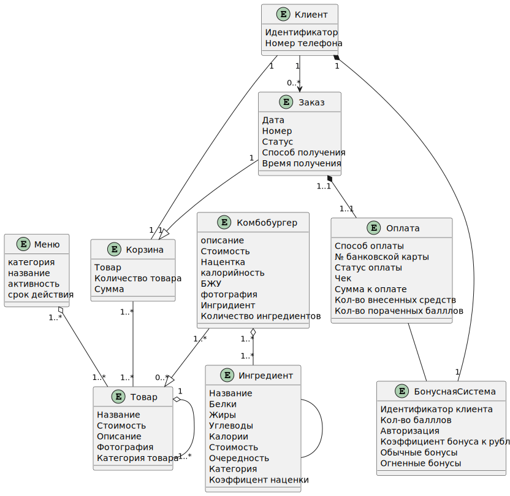
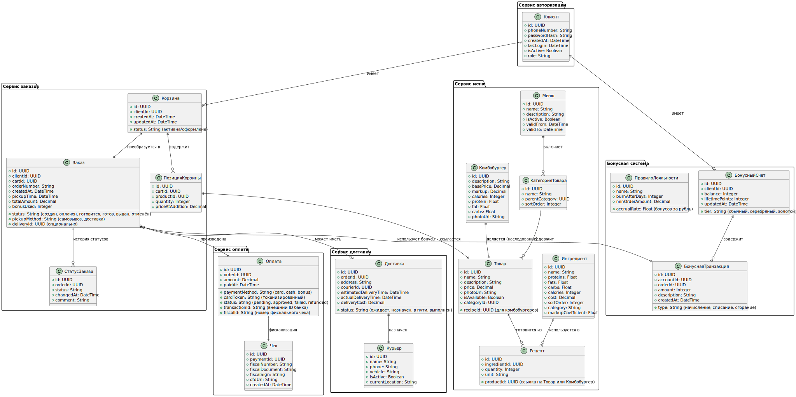

# Информационная модель

## Модель предметной области

В рамках MVP проекта были выделены основные сущности с атрибутами и определены связи между ними.

Базовыми сущностями являются:

- клиент
- заказ
- товар
- бонусная система
- меню
- комбобургер
- товар
- ингредиент
- корзина
- оплата

## Модель данных

| Микросервис | Класс | Атрибуты (с типами) | Описание класса |
|:---|:---|:---|:---|
| **Сервис авторизации** | `Клиент` | `id: UUID` `phoneNumber: String` `passwordHash: String` `createdAt: DateTime` `lastLogin: DateTime` `isActive: Boolean` `role: String` | Учётная запись пользователя (покупателя). Содержит данные для аутентификации и роли. |
| **Сервис меню** | `Меню` | `id: UUID` `name: String` `description: String` `isActive: Boolean` `validFrom: DateTime` `validTo: DateTime` | Совокупность категорий и товаров, действующая в определённый период (например, сезонное меню). |
| | `КатегорияТовара` | `id: UUID` `name: String` `parentCategory: UUID` `sortOrder: Integer` | Группировка товаров (бургеры, напитки, гарниры). Поддерживает вложенность. |
| | `Товар` | `id: UUID` `name: String` `description: String` `price: Decimal` `photoUrl: String` `isAvailable: Boolean` `categoryId: UUID` `recipeId: UUID` | Готовая позиция, доступная для заказа. Может быть простым блюдом или комбобургером (тогда `recipeId` указывает на рецепт комбо). |
| | `Ингредиент` | `id: UUID` `name: String` `proteins: Float` `fats: Float` `carbs: Float` `calories: Integer` `cost: Decimal` `sortOrder: Integer` `category: String` `markupCoefficient: Float` | Составная часть блюда (булочка, котлета, соус). Хранит пищевую ценность и себестоимость. |
| | `Комбобургер` | `id: UUID` `description: String` `basePrice: Decimal` `markup: Decimal` `calories: Integer` `protein: Float` `fat: Float` `carbs: Float` `photoUrl: String` | Специальный тип товара, собранный из ингредиентов. Является наследником (или частью) товара. |
| | `Рецепт` | `id: UUID` `productId: UUID` `ingredientId: UUID` `quantity: Integer` `unit: String` | Связующая таблица: указывает, какие ингредиенты и в каком количестве входят в состав товара или комбобургера. |
| **Сервис заказов** | `Корзина` | `id: UUID` `clientId: UUID` `createdAt: DateTime` `updatedAt: DateTime` `status: String` | Временная корзина покупателя, в которой накапливаются товары до оформления заказа. |
| | `ПозицияКорзины` | `id: UUID` `cartId: UUID` `productId: UUID` `quantity: Integer` `priceAtAddition: Decimal` | Отдельная позиция (товар) в корзине с ценой на момент добавления. |
| | `Заказ` | `id: UUID` `clientId: UUID` `cartId: UUID` `orderNumber: String` `createdAt: DateTime` `status: String` `pickupMethod: String` `pickupTime: DateTime` `totalAmount: Decimal` `bonusUsed: Integer` `deliveryId: UUID` | Оформленный заказ. Содержит основную информацию о клиенте, сумме, способе получения и статусе. |
| | `СтатусЗаказа` | `id: UUID` `orderId: UUID` `status: String` `changedAt: DateTime` `comment: String` | Журнал изменения статусов заказа (история). |
| **Сервис оплаты** | `Оплата` | `id: UUID` `orderId: UUID` `paymentMethod: String` `cardToken: String` `amount: Decimal` `status: String` `transactionId: String` `fiscalId: String` `paidAt: DateTime` | Транзакция оплаты по заказу. Может быть проведена разными способами (карта, наличные, бонусы). |
| | `Чек` | `id: UUID` `paymentId: UUID` `fiscalNumber: String` `fiscalDocument: String` `fiscalSign: String` `ofdUrl: String` `createdAt: DateTime` | Фискальный чек, сформированный после оплаты в соответствии с 54-ФЗ. |
| **Бонусная система** | `БонусныйСчет` | `id: UUID` `clientId: UUID` `balance: Integer` `lifetimePoints: Integer` `tier: String` `updatedAt: DateTime` | Бонусный счёт клиента, хранит текущий баланс, уровень лояльности и общее количество накопленных баллов. |
| | `БонуснаяТранзакция` | `id: UUID` `accountId: UUID` `orderId: UUID` `amount: Integer` `type: String` `description: String` `createdAt: DateTime` | Движение баллов по счёту: начисление, списание, сгорание. |
| | `ПравилоЛояльности` | `id: UUID` `name: String` `accrualRate: Float` `burnAfterDays: Integer` `minOrderAmount: Decimal` | Настройки бонусной программы: коэффициент начисления, срок жизни баллов, минимальная сумма заказа для активации. |
| **Сервис доставки** | `Доставка` | `id: UUID` `orderId: UUID` `address: String` `courierId: UUID` `status: String` `estimatedDeliveryTime: DateTime` `actualDeliveryTime: DateTime` `deliveryCost: Decimal` | Заказ на доставку. Связан с конкретным заказом и курьером, отслеживает статус и время. |
| | `Курьер` | `id: UUID` `name: String` `phone: String` `vehicle: String` `isActive: Boolean` `currentLocation: String` | Данные курьера: контакты, транспорт, активность и текущее местоположение (для трекинга). |