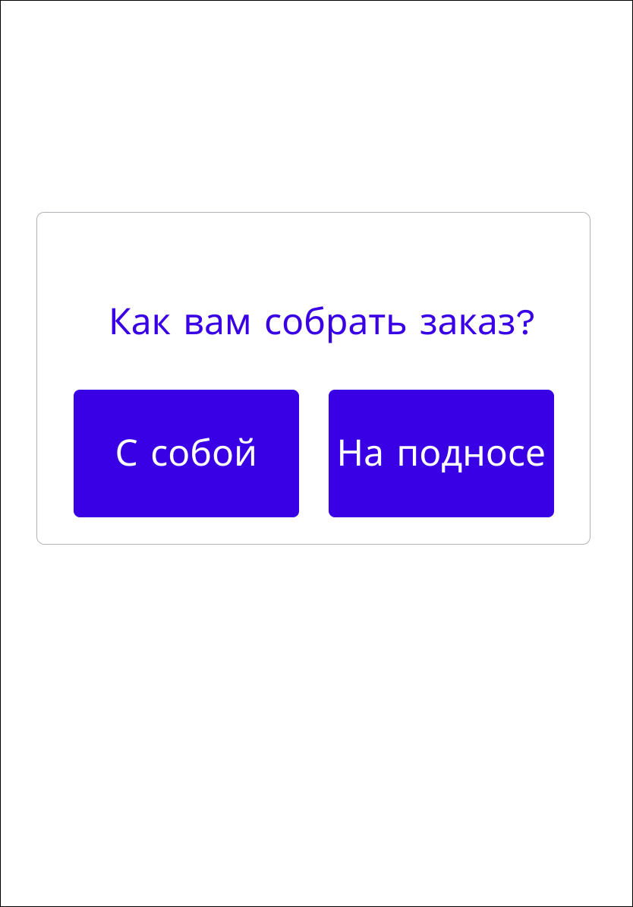
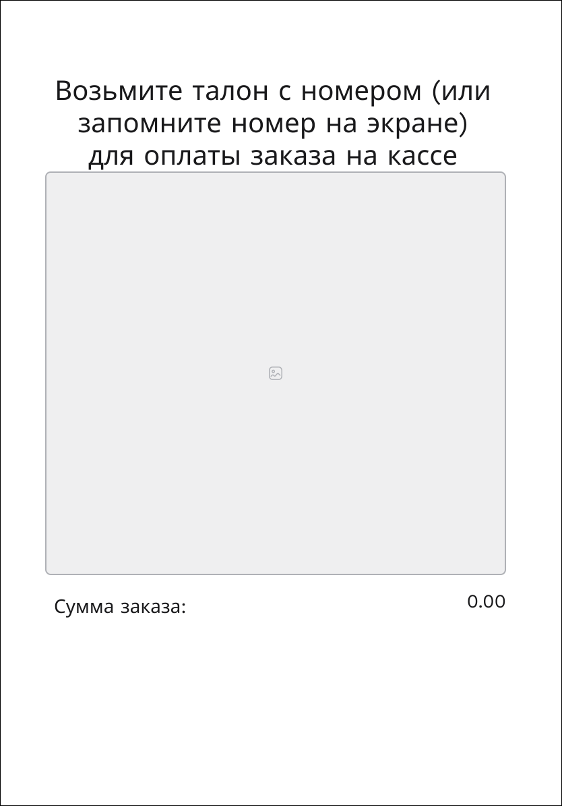

# Пользовательский интерфейс приложения

## 1.1 Вайрфреймы
Пользовательский интерфейс представлен в виде вайрфоеймов страниц веб-приложения.

### **`WF1`** Стартовое окно

### **`WF2`** Окно с меню

### **`WF3`** Детализация блюда

### **`WF4`** Корзина без авторизации в ЛК

### **`WF5`** Авторизация/регистраиция

### **`WF6`** Аутентификация

### **`WF7`** Корзина после авторизации в ЛК

### **`WF8`** Выбор заказа с собой или в зале

### **`WF9`** Выбор варианта оплаты

### **`WF10`** Оплата картой

### **`WF11`** Оплата наличными

### **`WF12`** Оплата СБП

### **`WF13`** Уведомление об оплате

### **`WF14`** Сообщение с ожиданием действий от пользователя

Кликабельный прототип доступен по [ссылке] (https://www.figma.com/proto/wcKSKkwPuZBi0HBJKPQGEw/Wireframes-Kit--Free---Community-?page-id=203%3A1449&node-id=205-1939&p=f&viewport=-55%2C500%2C0.11&t=7R9kjMROlA6X6Qch-1&scaling=scale-down&content-scaling=fixed&starting-point-node-id=207%3A1463)